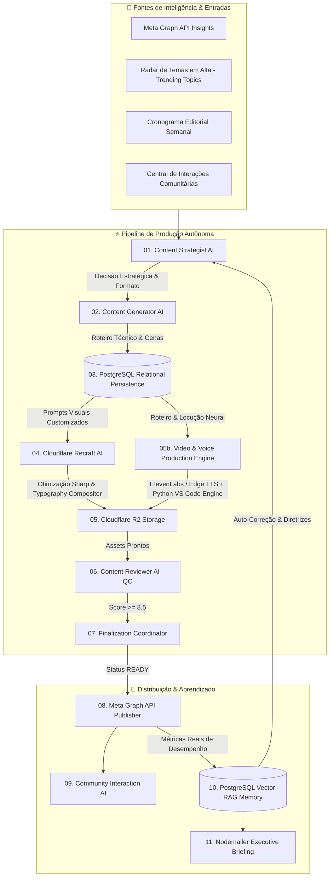

# 🌌 Syrius Agent — Especificação Oficial da Arquitetura Multi-Agente

> **Syrius Agent** é uma infraestrutura desktop autônoma de alta fidelidade para **estratégia editorial técnica, redação de alto valor, geração de artes com Recraft v3/v4 via Cloudflare AI, composição tipográfica segura com Sharp, produção de vídeos verticais Reels com locução neural e animação de código no VS Code, controle de qualidade automatizado (Quality Control QC $\ge 8.5$), publicação na Meta Graph API, interação comunitária e aprendizado contínuo com Auto-Correção via RAG Vetorial (`text-embedding-004`)**.

---

## 🏛️ 1. Visão Geral da Arquitetura

O sistema opera sob o paradigma de **Agentes Especialistas Concorrentes e Orquestrados em Pipeline**. Cada agente possui escopo isolado, entradas tipadas, validação estrutural rigorosa, fallback resiliente e persistência relacional no **PostgreSQL 16** através do **Prisma ORM 7**.



---

## 🤖 2. Os Agentes do Ecossistema

### 🎯 01. Content Strategist AI (Estrategista Editorial)
- **Responsabilidade**: Define o tema, formato (`CAROUSEL`, `SINGLE_IMAGE`, `REEL_SCRIPT`, `STORY_PHOTO`), objetivo (`AUTHORITY`, `VIRALITY`, `EDUCATION`, `ENGAGEMENT`, `REACH`) e gancho inicial (`hook`).
- **Fontes de Dados**:
  - Histórico dos últimos posts no PostgreSQL (evita repetições e saturação).
  - Dados reais de perfil e audiência da **Meta Graph API**.
  - Pautas planejadas no **Cronograma Editorial Semanal**.
  - Tópicos quentes capturados pelo **Radar de Temas em Alta**.
  - Memória RAG (diretrizes validadas e premissas refutadas).
- **Modelo de IA**: `Google Gemini 2.5 / 3.6 Flash` com extração JSON estruturada.

---

### ✍️ 02. Content Generator AI (Redator Técnico Especialista)
- **Responsabilidade**: Redige o conteúdo slide a slide / cena a cena com profundidade técnica, linguagem direta de desenvolvedor, gancho magnético, legenda densa, hashtags e chamadas de ação (CTAs).
- **Formatos Gerados**:
  1. **Carrossel Técnico (`CAROUSEL`)**: 6 a 8 slides estruturados para retenção, aprendizado e salvamentos.
  2. **Post Solo (`SINGLE_IMAGE`)**: 1 imagem de alto impacto visual com legenda editorial profunda.
  3. **Roteiro & Vídeo Reels (`REEL_SCRIPT` / `REEL`)**: Roteiro vertical 9:16 com narração neural e código-fonte progressivo para digitação animada no VS Code.
  4. **Stories Interativos (`STORY_PHOTO` / `STORIES_SEQUENCE`)**: Enquetes, caixas de perguntas, quizzes e pontes para o feed.
- **Integração RAG**: Injeta aprendizados históricos vetorizados para garantir que erros do passado não se repitam.

---

### 💾 03. Relational Persistence & Schema Agent (Camada de Dados)
- **Responsabilidade**: Gravação relacional transacional de posts, slides, histórico de prompts, reviews de qualidade e logs de execução.
- **Tecnologias**: **PostgreSQL 16** + **Prisma ORM 7** com driver adapter nativo `@prisma/adapter-pg`.
- **Status da Publicação**: `DRAFT` $\rightarrow$ `GENERATED` $\rightarrow$ `REVIEW` $\rightarrow$ `APPROVED` $\rightarrow$ `READY` $\rightarrow$ `SCHEDULED` $\rightarrow$ `PUBLISHED` (ou `FAILED`).

---

### 🎨 04. Visual & Typography Composer AI (Diretor de Arte & Composição)
- **Responsabilidade**: Renderização de assets visuais em 1080x1350 (Feed/Carrossel) ou 1080x1920 (Stories/Reels) com estética Dark Minimalist Tech.
- **Motor de Renderização**:
  - **Cloudflare AI Gateway** executando `recraft/recraftv4-1` e `recraft/recraftv3`.
  - **Sharp**: Redimensionamento com interpolação bicúbica, compressão PNG nível 9 e filtragem adaptativa.
  - **Typography Compositor**: Injeção de camada vetorial SVG com Glassmorphism flutuante e **margens de segurança 100% garantidas** (evita corte de texto nas bordas do Instagram).

---

### ☁️ 05. Cloudflare R2 Asset Storage & Nuvem
- **Responsabilidade**: Armazenamento em nuvem de alta disponibilidade compatível com S3 e geração de URLs públicas com expiração segura para consumo pela Meta Graph API.
- **Estratégia de Cache**: Salvamento local imediato durante a geração (`output/images/`) e sincronização sob demanda com o Cloudflare R2 no momento do envio.

---

### 🎬 05b. Video & Voice Production Engine (Motor de Reels & Locução)
- **Responsabilidade**: Produção ponta a ponta de vídeos verticais (1080x1920) para o Instagram Reels.
- **Pipeline de Áudio**:
  - Síntese primária via **ElevenLabs Multilingual v2** com clonagem de voz neural.
  - Fallback offline local via **Edge TTS Neural** (`pt-BR-AntonioNeural`).
- **Pipeline de Vídeo**:
  - Geração de 4 cenas contextuais de código real (O Problema $\rightarrow$ O Teste Unitário $\rightarrow$ A Refatoração $\rightarrow$ O Sucesso nos Testes) via Gemini AI.
  - Script Python (`render_reels_for_post.py`) com motor de digitação animada de código no VS Code.
  - Sincronização de legendas karaoke automatizadas via **OpenAI Whisper AI**.

---

### 🔍 06. Content Reviewer AI — Quality Control (QC $\ge 8.5$)
- **Responsabilidade**: Auditoria crítica impiedosa antes de qualquer post ser aprovado para agendamento.
- **Critérios Auditados (Notas de 0 a 10)**:
  - `technicalAccuracy`: Precisão de comandos, sintaxe, boas práticas e ausência de alucinações.
  - `hookQuality`: Força dos primeiros 3 segundos ou da capa para capturar retenção orgânica.
  - `structureQuality`: Fluidez narrativa e progressão lógica dos slides.
  - `educationalValue`: Densidade de aprendizado real para o desenvolvedor.
  - `engagementPotential`: Probabilidade de salvamentos (bookmarks) e compartilhamentos.
  - `visualConsistency`: Harmonia entre a direção visual dos slides e o conteúdo técnico.
- **Regra de Decisão**: Apenas publicações com `Score Geral >= 8.5` e `0 problemas críticos` recebem status `APPROVED`.

---

### 🚦 07. Finalization & Readiness Coordinator
- **Responsabilidade**: Validação final de integridade (presença de todos os assets visuais/áudio gerados), transição do post para `READY` e vinculação automática com o slot correspondente no **Cronograma Editorial**.

---

### 📲 08. Meta Graph API Autonomous Publisher
- **Responsabilidade**: Despacho oficial para os servidores do Instagram via Meta Graph API v20.0.
- **Capacidades**:
  - Criação de containers individuais de itens de carrossel com polling de status (`waitForContainer`).
  - Publicação de Carrosséis (2 a 10 slides), Imagens Únicas, Stories de Foto e Reels de Vídeo com Capa Oficial 9:16 customizada.
  - Suporte a exclusão de mídia anterior (`deletePrevious`) para republicações refinadas.
  - Captura e registro do permalink oficial do post no PostgreSQL.

---

### 💬 09. Community & Interactions AI Agent
- **Responsabilidade**: Monitoramento contínuo de comentários, DMs e stickers de perguntas do Instagram.
- **Capacidades**:
  - Geração de respostas instantâneas no tom de voz do criador com contextualização da marca.
  - **Conversão de Dúvidas em Posts**: Transforma perguntas complexas da comunidade em novos slots no Cronograma Editorial com 1 clique.
  - Modo Auto-Reply autônomo com toggle de ativação/desativação.

---

### 🧠 10. Growth, Analytics & Vector RAG Self-Correction Engine
- **Responsabilidade**: Auditoria profunda post a post baseada em métricas 100% reais da Meta API.
- **Camada Dupla de Diagnóstico**:
  - **Camada Macro**: Diagnóstico da saúde da conta, alcance real, interações, taxa de engajamento e diretrizes para o próximo ciclo.
  - **Camada Micro**: Diagnóstico individual de cada publicação (por que funcionou, o que prejudicou e força do gancho).
- **Memória RAG com `text-embedding-004` & Linhagem de Auto-Correção**:
  - Vetorização densa (768 dimensões) de insights e aprendizados.
  - **Calibração Estatística Rigorosa**: Amostragens pequenas (< 6 posts) são registradas obrigatoriamente como `HYPOTHESIS` (confiança $\le 0.40$). Hipóteses só viram `VALIDATED` após 6+ evidências empíricas.
  - **Auto-Correção & Rastreabilidade de Linhagem**: Invalidação e refutação automática de premissas quando novos dados contradizem teses anteriores, com vinculação explícita entre a tese refutada e a nova diretriz (`supersededById`) e comparação visual lado a lado.
  - **Filtros e Paginação**: Interface de exploração com filtros por status (Validadas, Hipóteses, Refutadas), busca instantânea e paginação limpa sem emojis.
- **Despacho de Relatórios**: Envio de briefings executivos HTML estilizados para o e-mail do criador via Nodemailer SMTP.

---

### 📈 11. Radar de Temas em Alta (Trending Topics & Compilador Multi-Fonte)
- **Responsabilidade**: Varredura das maiores tendências no ecossistema tech (DevOps, Backend, Frontend, IA, Segurança, Carreira), repositórios em alta no GitHub e notícias de tecnologia.
- **Capacidades**:
  - **Navegação em 4 Abas Especializadas**:
    1. *Destaques & Top Recomendações (5)*: Seleção das melhores oportunidades da semana.
    2. *Temas Gerais & Arquitetura (10)*: Pautas aprofundadas distribuídas pelos 6 pilares de engenharia.
    3. *Repositórios GitHub (Trending) (5)*: Repositórios reais coletados via GitHub API com dissecação em 1 clique via Repo-to-Post.
    4. *Notícias & Lançamentos Tech (5 a 10)*: Manchetes das últimas 24h a 7 dias.
  - **Compilador Concorrente de Notícias de 5 Fontes**: Scraping paralelo via `Promise.allSettled` no Hacker News API, Dev.to RSS, InfoQ Architecture, TecMundo Tech e Google News.
  - **Garantia de Cotas e Auto-Preenchimento**: Fallback resiliente que assegura a quantidade exata de itens mesmo se houver corte de tokens na resposta de IA.
  - **Sincronização em Tempo Real**: Monitoramento integrado ao `ActivitiesContext` que atualiza a tela sem recarregar.
  - **Direcionamento Obrigatório de Repositórios**: Inclusão mandatória do link do repositório na legenda e CTA falado/escrito no encerramento.
  - **Leitura Local Persistida no PostgreSQL**: Carregamento instantâneo em milissegundos a partir do banco de dados na inicialização com **zero chamadas automáticas de IA**, evitando consumo indevido de cotas e tokens.

---

### 🐙 12. Repo-to-Post Engine (Dissecador de Repositórios GitHub)
- **Responsabilidade**: Leitura automatizada de repositórios do GitHub (API pública + `README.md`) e transformação em conteúdo técnico de altíssimo valor.
- **Capacidades**:
  - Extração de métricas (stars, forks, tags, linguagem principal e arquitetura).
  - Geração estruturada de 3 formatos especializados: Carrossel de Arquitetura (4:5), Roteiro de Reels com VS Code (9:16) e Post Solo (4:5).
  - Despacho imediato para o pipeline de produção ou cronograma.

---

### 🧪 13. Laboratório de Testes A/B de Capas e Ganchos (Content Experiments)
- **Responsabilidade**: Formulação científica de testes A/B contrastantes para otimização contínua de retenção e conversão.
- **Capacidades**:
  - Geração de hipóteses contrastantes: **Variante A (Técnica & Pragmática)** vs **Variante B (Provocativa & Quebra de Padrão)**.
  - Testes focados em ganchos dos primeiros 3 segundos, estética de capa ou chamadas de ação para salvamento (CTAs).
  - Persistência na tabela `ContentExperiment` e integração com a memória RAG.

---

### 🌙 14. Piloto Noturno & Agendamento Autônomo (Hands-Free Planner)
- **Responsabilidade**: Planejamento semanal e auto-renovação de tendências 100% sem intervenção manual.
- **Capacidades**:
  - Execução programada em dia e horário customizáveis (Padrão: Domingo às 22:00).
  - Varredura de novas tendências no ecossistema tech, avanço/otimização da grade semanal e envio de resumo executivo por e-mail.

---

### ✏️ 15. Editor WYSIWYG de Slides & Recomposição Instantânea com Sharp
- **Responsabilidade**: Ajuste fino de títulos, códigos e textos nos slides gerados.
- **Capacidades**:
  - Edição inline em tempo real no visualizador de publicações.
  - Recomposição tipográfica da camada SVG sobre a arte PNG existente em < 500ms **sem custo de tokens de IA**.

---

### 🎙️ 16. Sala de Reunião com a Gestora Editorial (Clara / Estelar — Head Editorial)
- **Responsabilidade**: Central de ideação conversacional em linguagem natural com locução neural, despacho autônomo, substituição inteligente e distribuição balanceada na grade.
- **Capacidades**:
  - **Comunicação Bilateral por Texto e Áudio com Controles Estilo WhatsApp**:
    - Gravação com lixeira para cancelamento instantâneo, pausa/retomada com indicador âmbar, barras de ondas sonoras dinâmicas e botão de envio direto.
    - Respostas faladas com voz neural feminina (`pt-BR-FranciscaNeural` via Edge TTS local).
  - **Abstração Total de Mídia**: O criador foca exclusivamente no conteúdo e nas ideias técnicas; a Gestora define o formato ideal (Carrossel, Reels ou Post Solo) e o Ângulo Narrativo nos bastidores.
  - **Substituição Inteligente & Mudança de Ideia (`REPLACED_PREVIOUS_PAUTA`)**: Se o criador mudar de ideia após aprovar uma pauta ("mudei de ideia, quero a opção 2"), o sistema cancela e remove automaticamente o slot anterior no PostgreSQL, registrando a nova pauta sem duplicidade.
  - **Distribuição Dinâmica na Grade & Prevenção de Conflitos**:
    - A Gestora consulta slots ocupados em tempo real e sugere apenas janelas de publicação livres (Segunda 18:30, Terça 18:30, Quarta 19:00, Quinta 18:00, Sexta 17:30, Domingo 19:30).
    - O backend possui detecção de colisão que impede empilhamento no mesmo dia e horário.

---

## 🗄️ 3. Modelo de Dados Relacional (PostgreSQL / Prisma)

| Tabela | Função Principal |
| :--- | :--- |
| `Post` | Registro mestre da publicação (tema, formato, status, caption, hashtags, instagramMediaId, instagramUrl). |
| `Slide` | Elementos visuais/cenas ordenados (número, título, texto, visualDirection, imagePath). |
| `GenerationLog` | Rastreabilidade de chamadas a provedores de IA, prompts e logs de erro. |
| `ContentReview` | Avaliação do Quality Control (scores detalhados, forças, problemas, sugestões e resumo). |
| `GlobalAnalyticsReport` | Relatório consolidado periódico de métricas, saúde da conta e diretrizes estratégicas. |
| `PostAnalyticsAudit` | Diagnóstico individualizado post a post com métricas de retenção, plays, watch time e tráfego. |
| `LearningInsightEmbedding` | Memória vetorial RAG (vetores de 768 dimensões, status de hipótese, score de confiança e auto-correções). |
| `EditorialScheduleSlot` | Grade semanal de publicações com horários, formatos, objetivos, pilares e status. |
| `PendingRecommendedTopic` | Fila FIFO de recomendações geradas pelo Analytics para a próxima semana. |
| `ContentExperiment` | Registro de testes A/B estruturados (variável de teste, hipótese e resultado). |
| `TrendingTopic` | Radar de tendências em alta ativas com pontuação de relevância e expiração. |

---

## 🛡️ 4. Tolerância a Falhas & Resiliência

1. **Rotação Automática de Chaves Gemini**: Alternância inteligente de chaves de API com detecção de rate limit (HTTP 429) e cotas esgotadas.
2. **Auto-Reparação de JSON Truncado**: Algoritmo resiliente que fecha automaticamente chaves e colchetes em payloads que sofram corte de tokens.
3. **Fallback Triplo de Síntese de Voz**: ElevenLabs AI $\rightarrow$ Edge TTS Neural Local (`pt-BR-AntonioNeural`) $\rightarrow$ Alerta informativo.
4. **Validação Heurística no QC**: Caso o modelo de IA oscile no formato de saída da revisão, um validador heurístico inspeciona a presença de títulos, cenas e legendas para evitar bloqueio do fluxo.
5. **Streaming de Mídia HTTP 206**: Protocolo customizado `media://` e middleware Vite para reprodução local de vídeos MP4 e áudios MP3 com suporte nativo a seek/scrub na interface desktop.

---

## 🚀 5. Como Iniciar o Sistema

```bash
# Instala dependências
npm install

# Aplica migrações no PostgreSQL
npx prisma db push
npx prisma generate

# Executa em modo desenvolvimento (Vite + Electron)
npm run dev
```

---

## 📋 6. TODO & Roadmap de Evolução

O backlog detalhado e planejamento técnico de novas fases está documentado no arquivo [`TODO.md`](./TODO.md).

1. **📱 Syrius Mobile App (React Native / Expo & API Gateway)**:
   - Cronograma editorial completo em timeline vertical, controle móvel de Autoplay e alternância entre semanas.
   - Sala de Reunião com a Gestora no bolso com gravação de áudio estilo WhatsApp e locução neural feminina.
   - Notificações push em tempo real com botão de aprovação imediata para posts com Quality Control $\ge 8.5$.
   - Captura de fotos para Stories técnicos com IA e moderação de interações comunitárias.

2. **🎭 Avatar Neural & Vídeos com Rosto do Criador (HeyGen / LivePortrait Híbrido)**:
   - Suporte a vídeos verticais com a face real do criador via sincronização labial neural (*lipsync*).
   - Layout dinâmico *Picture-in-Picture* (0-4s Gancho com rosto em destaque $\rightarrow$ 4-30s PiP flutuante com código/terminal $\rightarrow$ 30-40s Fechamento com CTA).
   - Conexão via **HeyGen API / Replicate Serverless** e suporte opcional a **LivePortrait** local com aceleração GPU NVIDIA.

3. **🌐 Expansão Multi-Plataforma (Fase 2)**:
   - Despacho e adaptação automática de formatos para LinkedIn (Artigos e Carrosséis PDF), Threads, X (Twitter) e YouTube Shorts.

