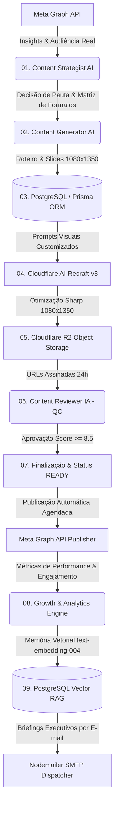

# 🌌 Syrius Agent (Autonomous Instagram AI Pipeline & Growth Engine)

> **Syrius Agent** é uma plataforma desktop autônoma de alta performance para **planejamento estratégico, redação técnica, geração de artes em alta definição (Recraft v3), auditoria de qualidade (QC), publicação automática na Meta Graph API, interação com comunidade e diagnóstico de analytics com auto-correção via RAG**.

---

## 🌟 Visão Geral

O **Syrius Agent** opera como um **Head de Social Media e Content Strategist autônomo** para desenvolvedores, criadores de conteúdo e empresas de tecnologia.

O sistema analisa dados reais de audiência e insights do Instagram, equilibra uma matriz editorial multiformato (Carrosséis, Posts Solos, Roteiros de Reels e Stories), gera imagens em 1080x1350 na identidade visual dark minimalista via **Cloudflare AI (Recraft v3)**, armazena os assets no **Cloudflare R2**, audita todo o conteúdo com IA (Score $\ge 8.5$), realiza a publicação oficial ou agendamento na **Meta Graph API**, responde comentários autonomamente e compila auditorias executivas periódicas enviadas por e-mail.

---

## 🏗️ Arquitetura & Stack Tecnológica



### 🛠️ Tecnologias Principais:
- **Frontend / Desktop**: [Electron 34](https://www.electronjs.org/) + [React 19](https://react.dev/) + [Vite](https://vitejs.dev/) (Interface Dark Glass sem frameworks externos de CSS).
- **Inteligência Artificial**: [Google Gemini 2.5 Flash](https://deepmind.google/technologies/gemini/) com rotação automática de chaves e extração JSON estruturada.
- **Geração de Imagens**: [Cloudflare AI Gateway (Recraft v3 / v4)](https://developers.cloudflare.com/workers-ai/models/recraft-v4/) + [Sharp](https://sharp.pixelplumbing.com/) para composição 1080x1350 PNG de alta fidelidade.
- **Armazenamento em Nuvem**: [Cloudflare R2 Object Storage](https://developers.cloudflare.com/r2/) via API compatível com S3 e URLs pré-assinadas.
- **Banco de Dados & ORM**: [PostgreSQL 16](https://www.postgresql.org/) + [Prisma ORM 7](https://www.prisma.io/).
- **Integração de Redes**: [Meta Graph API v20.0](https://developers.facebook.com/docs/instagram-api/) para publicação de Carrosséis, Imagens Únicas e Stories.
- **Memória RAG**: Aprendizado contínuo vetorizado com `text-embedding-004` e validação empírica de hipóteses.

---

## ⚡ As 7 Etapas do Pipeline Autônomo

| Etapa | Nome | Descrição |
| :--- | :--- | :--- |
| **01** | **Estratégia & Pauta** | Consulta histórico no banco, métricas do Instagram e decide o tema, formato e objetivo estratégico. |
| **02** | **Redação de Conteúdo** | Criação técnica dos slides/cenas, gancho provocativo, legenda editorial e hashtags. |
| **03** | **Persistência PostgreSQL** | Gravação relacional do post e dos slides no banco de dados via Prisma ORM. |
| **04** | **Geração de Artes** | Renderização com Cloudflare Recraft AI e ajuste de resolução com Sharp (1080x1350). |
| **05** | **Armazenamento R2** | Upload dos buffers no Cloudflare R2 e vinculação de caminhos e URLs no PostgreSQL. |
| **06** | **Quality Control (QC)** | Auditoria por IA: precisão técnica, hook, fluidez e aprovação (Score mínimo $\ge 8.5$). |
| **07** | **Finalização & Pronto** | Validação final de integridade e transição de status para `READY`. |

---

## 📱 Formatos de Conteúdo Suportados

1. **📚 Carrossel Técnico (`CAROUSEL`)**:
   - 6 Slides estruturados para máxima retenção, autoridade e salvamentos (Bookmarks).
2. **📸 Post Solo (`SINGLE_IMAGE`)**:
   - 1 Imagem de alto impacto (1080x1350) + legenda densa e aprofundada focada em compartilhamentos.
3. **🎬 Roteiro de Reels (`REEL_SCRIPT`)**:
   - Storyboard em 4 cenas (Gancho, Problema, Solução, CTA) de 30-50 segundos para topo de funil.
4. **⚡ Stories Interativos (`STORIES_SEQUENCE`)**:
   - Sequência de 3 telas com enquetes, caixas de perguntas e CTAs de engajamento diário.

---

## 🚀 Como Executar Localmente

### 1. Pré-requisitos
- Node.js 20+
- PostgreSQL 15+ ou Docker Compose
- Chave de API Google Gemini
- Credenciais Cloudflare (Account ID, API Token com Workers AI e R2)

### 2. Instalação
```bash
# Clone o repositório
git clone https://github.com/Intern-Yago/Syrius-Agent.git
cd Syrius-Agent

# Instale as dependências
npm install

# Configure as variáveis de ambiente
cp .env.example .env

# Execute as migrações do banco
npx prisma db push
npx prisma generate
```

### 3. Rodando o Aplicativo Desktop
```bash
npm run dev
```

---

## 📄 Licença
Distribuído sob a licença ISC. Desenvolvido por **Yago** & Antigravity AI Engine.
