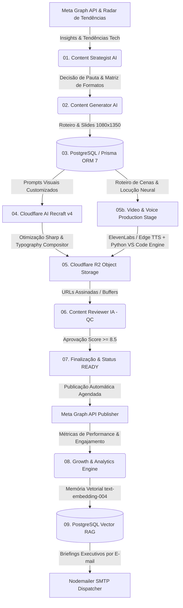

# 🌌 Syrius Agent — Autonomous Instagram AI Pipeline & Growth Engine

> **Syrius Agent** é uma plataforma desktop autônoma de alta performance para **planejamento estratégico, redação técnica, geração de artes (Recraft v3/v4), produção de vídeo Reels com animação de código no VS Code e locução neural, auditoria de qualidade (QC), publicação automática na Meta Graph API, interação com comunidade e diagnóstico de analytics com auto-correção via RAG**.

---

## 🌟 Visão Geral

O **Syrius Agent** opera como um **Head de Social Media e Content Strategist autônomo** para desenvolvedores, criadores de conteúdo e empresas de tecnologia.

O sistema analisa dados reais de audiência e insights do Instagram, equilibra uma matriz editorial multiformato (Carrosséis, Posts Solos, Roteiros de Reels e Stories), gera imagens em 1080x1350 na identidade visual dark minimalista via **Cloudflare AI (Recraft v3/v4)**, compõe tipografia com margens seguras via **Sharp**, renderiza vídeos verticais Reels (1080x1920) com digitação animada de código real no VS Code e legendas sincronizadas via **Whisper AI**, armazena assets no **Cloudflare R2**, audita todo o conteúdo com IA (Score $\ge 8.5$), realiza a publicação oficial ou agendamento na **Meta Graph API**, responde comentários autonomamente e compila auditorias executivas periódicas enviadas por e-mail.

---

## 🏗️ Arquitetura & Stack Tecnológica



### 🛠️ Tecnologias Principais:
- **Frontend / Desktop**: [Electron 34](https://www.electronjs.org/) + [React 19](https://react.dev/) + [Vite](https://vitejs.dev/) (Interface Dark Glass nativa e fluida).
- **Inteligência Artificial**: [Google Gemini 2.5 / 3.6 Flash](https://deepmind.google/technologies/gemini/) com rotação automática de modelos e extração JSON estruturada.
- **Geração de Imagens**: [Cloudflare AI Gateway (Recraft v4 / v3)](https://developers.cloudflare.com/workers-ai/models/recraft-v4/) + [Sharp](https://sharp.pixelplumbing.com/) para composição 1080x1350 PNG de alta fidelidade e margens de segurança tipográfica.
- **Produção de Vídeo & Áudio**: [ElevenLabs AI](https://elevenlabs.io/) + [Edge TTS Neural](https://github.com/rany2/edge-tts) + [OpenAI Whisper](https://github.com/openai/whisper) + Motor Python de Digitação Animada no VS Code.
- **Armazenamento em Nuvem**: [Cloudflare R2 Object Storage](https://developers.cloudflare.com/r2/) via API compatível com S3 e URLs pré-assinadas.
- **Banco de Dados & ORM**: [PostgreSQL 16](https://www.postgresql.org/) + [Prisma ORM 7](https://www.prisma.io/) com driver adapter de alta performance.
- **Integração de Redes**: [Meta Graph API v20.0](https://developers.facebook.com/docs/instagram-api/) para publicação de Carrosséis, Imagens Únicas, Stories e Reels.
- **Memória RAG & Auto-Correção**: Aprendizado contínuo vetorizado com `text-embedding-004` e validação empírica de hipóteses.

---

## ⚡ As 8 Etapas do Pipeline Autônomo

| Etapa | Nome | Descrição |
| :--- | :--- | :--- |
| **01** | **Estratégia & Pauta** | Consulta histórico no banco, métricas do Instagram, radar de tendências e decide tema, formato e objetivo. |
| **02** | **Redação de Conteúdo** | Criação técnica dos slides/cenas, gancho provocativo, legenda editorial aprofundada e hashtags. |
| **03** | **Persistência PostgreSQL** | Gravação relacional do post e dos slides/cenas no banco de dados via Prisma ORM. |
| **04** | **Geração de Artes** | Renderização com Cloudflare Recraft AI, composição de títulos em Glassmorphism e ajuste Sharp (1080x1350). |
| **05** | **Armazenamento R2** | Upload dos buffers no Cloudflare R2 e vinculação de caminhos e URLs pré-assinadas no PostgreSQL. |
| **05b** | **Produção de Áudio e Vídeo** | Síntese de voz neural (ElevenLabs / Edge TTS) e renderização de vídeo vertical Reels com animação de código no VS Code. |
| **06** | **Quality Control (QC)** | Auditoria por IA: precisão técnica, gancho, fluidez, design e aprovação (Score mínimo $\ge 8.5$). |
| **07** | **Finalização & Pronto** | Validação final de integridade e transição de status para `READY` para agendamento ou publicação imediata. |

---

## 🧭 Módulos do Sistema

1. **⚡ Dashboard em Tempo Real**:
   - Visualização gráfica de todas as etapas com progresso dinâmico, logs em tempo real, reexecução a partir de etapas falhas (`retry`) e alertas de cota.
2. **📈 Radar de Temas em Alta (Trending Topics)**:
   - Varredura periódica de tendências quentes no ecossistema tech (DevOps, Backend, Frontend, IA, Segurança, Carreira) com despacho em 1 clique para o pipeline.
3. **📅 Cronograma Editorial Semanal & Fila FIFO**:
   - Grade semanal por pilares (Autoridade, Viralidade, Educação, Engajamento, Alcance) com suporte a Stories interativos, geração sequencial em lote e alerta no horário agendado.
4. **📊 Central de Atividades em Background**:
   - Controle total sobre processos concorrentes com botões de Pausar, Retomar (Play), Parar (Cancel), Recomeçar (Retry) e log de diagnósticos com cópia rápida.
5. **📚 Acervo de Publicações & Visualizador de Mídia**:
   - Galeria completa de posts com visualização em alta definição, player de Reels/áudio com seeking (HTTP 206), regeneração seletiva de artes e publicação oficial no Instagram.
6. **💬 Central de Interações & Respostas com IA**:
   - Monitoramento de comentários/DMs, geração de respostas com tom do criador e conversão de dúvidas em novas pautas editoriais.
7. **🧠 Analytics, Memória RAG & Relatórios Executivos**:
   - Auditoria profunda post a post, aprendizado contínuo vetorizado, envio de relatórios HTML por e-mail e exportação em Markdown/JSON.
8. **🎙️ Laboratório de Voz Neural & Detecção de Hardware**:
   - Clonagem de voz ElevenLabs, síntese offline local com Edge TTS, monitoramento de GPU/VRAM e scripts de treinamento local.
9. **🐙 Repo-to-Post Engine (GitHub Dissector)**:
   - Extração automática de metadados, arquitetura e READMEs do GitHub, transformando repositórios em Carrosséis, Reels ou Posts Solos em 1 clique.
10. **🧪 Laboratório de Testes A/B (Content Experiments)**:
    - Formulação científica de variantes contrastantes (Técnica & Pragmática vs Provocativa & Quebra de Padrão) para otimizar ganchos e capas.
11. **🌙 Piloto Noturno Autônomo (Hands-Free Planner)**:
    - Execução semanal agendada (Padrão: Domingo às 22:00) para auto-renovação de tendências, geração inteligente do cronograma e envio de briefing executivo.
12. **✏️ Editor WYSIWYG de Slides & Recomposição Instantânea**:
    - Ajuste fino de títulos e textos de slides no visualizador com recomposição gráfica via Sharp em < 500ms sem custo de tokens de IA.

---

## 📱 Formatos de Conteúdo Suportados

1. **📚 Carrossel Técnico (`CAROUSEL`)**:
   - 6 a 8 Slides estruturados para máxima retenção, autoridade técnica e salvamentos (Bookmarks).
2. **📸 Post Solo (`SINGLE_IMAGE`)**:
   - 1 Imagem de alto impacto (1080x1350) + legenda densa e aprofundada focada em compartilhamentos.
3. **🎬 Roteiro & Vídeo Reels (`REEL_SCRIPT` / `REEL`)**:
   - Vídeo vertical 9:16 (1080x1920) com narração neural, animação de digitação de código no VS Code e legendas sincronizadas.
4. **⚡ Stories Interativos (`STORIES_SEQUENCE` / `STORY_PHOTO`)**:
   - Sequência com enquetes, caixas de perguntas, quizzes e CTAs de engajamento diário.

---

## 🚀 Como Executar Localmente

### 1. Pré-requisitos
- Node.js 20+
- PostgreSQL 15+ ou Docker Compose
- Python 3.10+ (opcional para renderização local de Reels com animação de código)
- Chave de API Google Gemini
- Credenciais Cloudflare (Account ID, API Token com Workers AI e R2)
- Credenciais Meta Graph API (Token de Acesso e Instagram Account ID)

### 2. Instalação
```bash
# Clone o repositório
git clone https://github.com/Intern-Yago/Syrius-Agent.git
cd Syrius-Agent

# Instale as dependências Node.js
npm install

# Configure as variáveis de ambiente
cp .env.example .env

# Execute as migrações do banco no PostgreSQL
npx prisma db push
npx prisma generate
```

### 3. Rodando o Aplicativo Desktop
```bash
# Inicia o Vite e o Electron em modo concorrente
npm run dev
```

### 4. Build de Produção
```bash
npm run build
```

---

## 🗺️ Roadmap & Futuras Atualizações

1. **Avatar Neural & Vídeos com Rosto do Criador (HeyGen / LivePortrait Híbrido)**:
   - Suporte a vídeos verticais com a face real do criador via sincronização labial neural (*lipsync*).
   - Layout dinâmico *Picture-in-Picture*:
     - **0 a 4s (Gancho)**: Rosto em tela cheia com título provocativo para retenção no scroll.
     - **4 a 30s (Conteúdo Prático)**: Rosto em moldura flutuante no canto enquanto o centro exibe código no VS Code, terminal ou navegador.
     - **30 a 40s (Fechamento)**: Rosto no centro com veredito técnico e chamada para ação (CTA).
   - Integração com **HeyGen API / Replicate Serverless** e suporte opcional a **LivePortrait** local com aceleração GPU NVIDIA.

2. **Expansão Multi-Plataforma (Fase 2)**:
   - Despacho e adaptação automática de formatos para LinkedIn, Threads, X (Twitter) e YouTube Shorts.

---

## 📄 Licença
Distribuído sob a licença ISC. Desenvolvido por **Yago** & Antigravity AI Engine.
